# Open5GS Practice

# Installation and Configuration and demonstration

ICT Innovation Square

2024 Digital New Technology Course 2nd Session \- Network Course

2024\-09\-02 Lee\, Sanghoon

<span style="color:#222222"> __Open5GS \+ UERANSIM 5G __ </span>  <span style="color:#222222"> __Network__ </span>  <span style="color:#222222"> __ __ </span>  <span style="color:#222222"> __Overview__ </span>

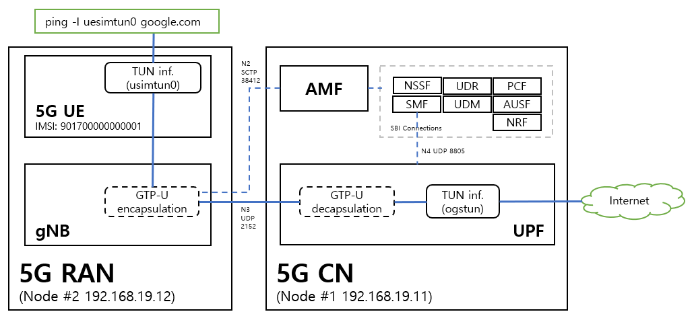

# Network Configuration

Network mode : NAT \+ Host\-Only Network

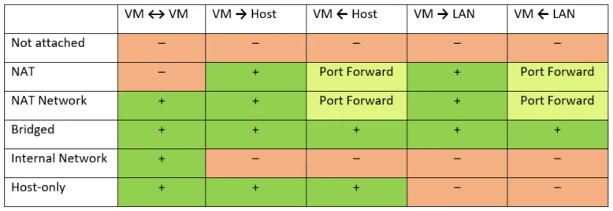

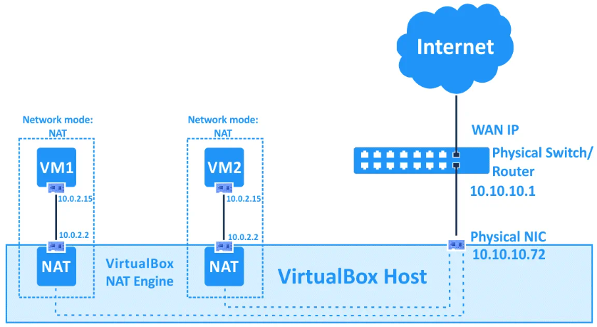

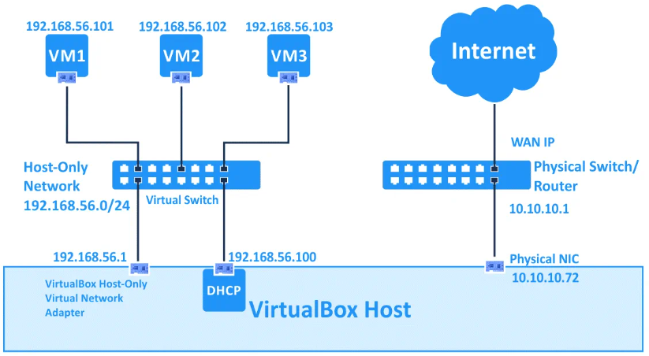

## <span style="color:#222222"> __Ubuntu pre\-installed VM image download__ </span>


### 1 Download Ubuntu 20\.04 VM image for Node\#1 and Node\#2 :
  * <span style="color:#222222">Download from : </span>  <span style="color:#222222">[https://www\.linuxvmimages\.com/images/ubuntu\-2004/\#ubuntu\-20044](https://www.linuxvmimages.com/images/ubuntu-2004/#ubuntu-20044)</span>  <span style="color:#222222"> </span>
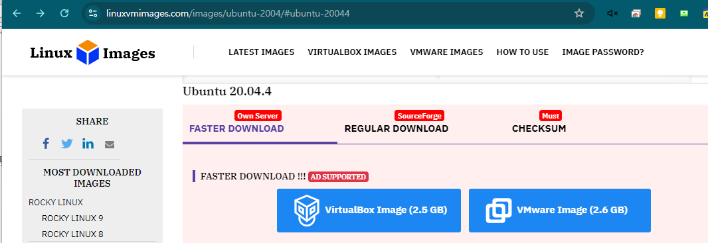

### 2 <span style="color:#222222">Open the image in VM tool and clone it to node1 and node2</span>

### 3 <span style="color:#222222">Create Host only network with 192\.168\.19\.1/24</span>
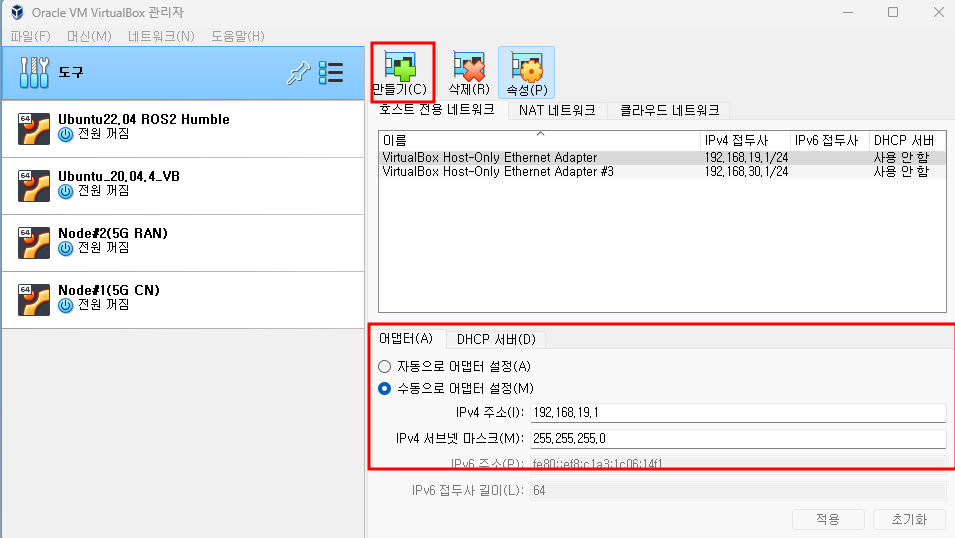

### 4 <span style="color:#222222">Select the VM and click Setting tab and select adapter2 and select host only network which is created previous\.</span>
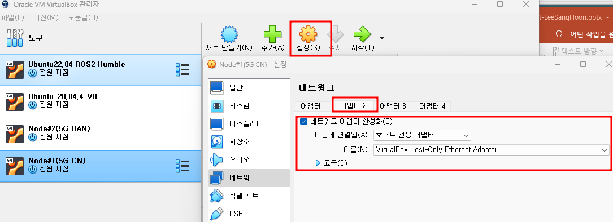

### 5 <span style="color:#222222">Run the node VM and set the IP of host only network interface</span>


```bash
cd /etc/netplan
sudo vi 01-network-manager-all.yaml:
add ethernets config (ex, for node1)
--------
ethernets:
 enp0s3:
  dhcp4: true
 enp0s8:
  dhcp4: false
  addresses: [192.168.19.11/24]
--------
sudo netplan apply
** for checking, run "Ifconfig"
```

<span style="color:#222222"> __node\#1\(5G CN\) \- __ </span>  <span style="color:#222222"> __Open5GS Installation__ </span>

<span style="color:#222222">Node\#1: Ubuntu 20\.04:</span>

<span style="color:#222222">Install Open5GS with a Package Manager</span>

<span style="color:#222222">mongodb</span>  <span style="color:#222222"> Installation:</span>

<span style="color:#222222">Install the </span>  <span style="color:#222222">WebUI</span>  <span style="color:#222222"> of Open5GS</span>

<span style="color:#222222">Node\.js Installation:</span>

<span style="color:#222222">\# Download and import the </span>  <span style="color:#222222">Nodesource</span>  <span style="color:#222222"> GPG key</span>

<span style="color:#222222">sudo</span>  <span style="color:#222222"> apt update</span>

<span style="color:#222222">sudo</span>  <span style="color:#222222"> apt install \-y ca\-certificates curl </span>  <span style="color:#222222">gnupg</span>

<span style="color:#222222">sudo</span>  <span style="color:#222222"> </span>  <span style="color:#222222">mkdir</span>  <span style="color:#222222"> \-p /</span>  <span style="color:#222222">etc</span>  <span style="color:#222222">/apt/keyrings</span>

<span style="color:#222222">curl \-</span>  <span style="color:#222222">fsSL</span>  <span style="color:#222222"> https://deb\.nodesource\.com/gpgkey/nodesource\-repo\.gpg\.key | </span>  <span style="color:#222222">sudo</span>  <span style="color:#222222"> </span>  <span style="color:#222222">gpg</span>  <span style="color:#222222"> \-\-</span>  <span style="color:#222222">dearmor</span>  <span style="color:#222222"> \-o /</span>  <span style="color:#222222">etc</span>  <span style="color:#222222">/apt/keyrings/</span>  <span style="color:#222222">nodesource\.gpg</span>

<span style="color:#222222">\# Create deb repository</span>

<span style="color:#222222">NODE\_MAJOR=20</span>

<span style="color:#222222">echo "deb \[signed\-by=/</span>  <span style="color:#222222">etc</span>  <span style="color:#222222">/apt/keyrings/</span>  <span style="color:#222222">nodesource\.gpg</span>  <span style="color:#222222">\] https://deb\.nodesource\.com/node\_$NODE\_MAJOR\.x </span>  <span style="color:#222222">nodistro</span>  <span style="color:#222222"> main" | </span>  <span style="color:#222222">sudo</span>  <span style="color:#222222"> tee /</span>  <span style="color:#222222">etc</span>  <span style="color:#222222">/apt/</span>  <span style="color:#222222">sources\.list\.d</span>  <span style="color:#222222">/</span>  <span style="color:#222222">nodesource\.list</span>

<span style="color:#222222">\# Run Update and Install</span>

<span style="color:#222222">sudo</span>  <span style="color:#222222"> apt update</span>

<span style="color:#222222">sudo</span>  <span style="color:#222222"> apt install </span>  <span style="color:#222222">nodejs</span>  <span style="color:#222222"> \-y</span>

<span style="color:#222222">sudo</span>  <span style="color:#222222"> apt\-get install </span>  <span style="color:#222222">gnupg</span>  <span style="color:#222222"> curl</span>

<span style="color:#222222">curl \-</span>  <span style="color:#222222">fsSL</span>  <span style="color:#222222"> https://www\.mongodb\.org/static/pgp/server\-6\.0\.asc | </span>  <span style="color:#222222">sudo</span>  <span style="color:#222222"> </span>  <span style="color:#222222">gpg</span>  <span style="color:#222222"> \-o /</span>  <span style="color:#222222">usr</span>  <span style="color:#222222">/share/keyrings/mongodb\-server\-6\.0\.gpg    \-\-</span>  <span style="color:#222222">dearmor</span>

<span style="color:#222222">echo "deb \[ arch=amd64\,arm64 signed\-by=/</span>  <span style="color:#222222">usr</span>  <span style="color:#222222">/share/keyrings/mongodb\-server\-6\.0\.gpg \] https://repo\.mongodb\.org/apt/ubuntu focal/</span>  <span style="color:#222222">mongodb</span>  <span style="color:#222222">\-org/6\.0 multiverse" | </span>  <span style="color:#222222">sudo</span>  <span style="color:#222222"> tee /</span>  <span style="color:#222222">etc</span>  <span style="color:#222222">/apt/</span>  <span style="color:#222222">sources\.list\.d</span>  <span style="color:#222222">/mongodb\-org\-6\.0\.list</span>

<span style="color:#222222">sudo</span>  <span style="color:#222222"> apt\-get update</span>

<span style="color:#222222">sudo</span>  <span style="color:#222222"> apt\-get install \-y </span>  <span style="color:#222222">mongodb</span>  <span style="color:#222222">\-org=6\.0\.17 </span>  <span style="color:#222222">mongodb</span>  <span style="color:#222222">\-org\-database=6\.0\.17 </span>  <span style="color:#222222">mongodb</span>  <span style="color:#222222">\-org\-server=6\.0\.17 </span>  <span style="color:#222222">mongodb</span>  <span style="color:#222222">\-org\-mongos=6\.0\.17 </span>  <span style="color:#222222">mongodb</span>  <span style="color:#222222">\-org\-tools=6\.0\.17</span>

<span style="color:#222222">sudo</span>  <span style="color:#222222"> </span>  <span style="color:#222222">systemctl</span>  <span style="color:#222222"> start </span>  <span style="color:#222222">mongod</span>

<span style="color:#222222">open5gs Installation:</span>

<span style="color:#222222">sudo</span>  <span style="color:#222222"> add\-apt\-repository ppa:open5gs/latest</span>

<span style="color:#222222">sudo</span>  <span style="color:#222222"> apt update</span>

<span style="color:#222222">sudo</span>  <span style="color:#222222"> apt install –y open5gs</span>

<span style="color:#222222">curl \-</span>  <span style="color:#222222">fsSL</span>  <span style="color:#222222"> https://open5gs\.org/open5gs/assets/webui/install | </span>  <span style="color:#222222">sudo</span>  <span style="color:#222222"> \-E bash \-</span>

<span style="color:#222222">Routing setting:</span>

<span style="color:#222222">sudo</span>  <span style="color:#222222"> </span>  <span style="color:#222222">sysctl</span>  <span style="color:#222222"> \-w net\.ipv4\.ip\_forward=1</span>

<span style="color:#222222">sudo</span>  <span style="color:#222222"> </span>  <span style="color:#222222">sysctl</span>  <span style="color:#222222"> \-w net\.ipv6\.conf\.all\.forwarding=1</span>

<span style="color:#222222">sudo</span>  <span style="color:#222222"> iptables \-t </span>  <span style="color:#222222">nat</span>  <span style="color:#222222"> \-A POSTROUTING \-s 10\.45\.0\.0/16 \! \-o </span>  <span style="color:#222222">ogstun</span>  <span style="color:#222222"> \-j MASQUERADE</span>

<span style="color:#222222">sudo</span>  <span style="color:#222222"> ip6tables \-t </span>  <span style="color:#222222">nat</span>  <span style="color:#222222"> \-A POSTROUTING \-s 2001:230:cafe::/48 \! \-o </span>  <span style="color:#222222">ogstun</span>  <span style="color:#222222"> \-j MASQUERADE</span>

<span style="color:#222222"> __node\#1\(5G CN\) \- __ </span>  <span style="color:#222222"> __Open5GS Installation \- Continue__ </span>


* <span style="color:#222222">Node\#1: Ubuntu 20\.04:</span>
* <span style="color:#222222">Configure Open5GS</span>
  * <span style="color:#222222">Out of the box\, the default configurations see all of the Open5GS components </span>
  * <span style="color:#222222">fully configured for use on a single computer\. </span>
  * <span style="color:#222222">They are set to communicate with each other using the local loopback address space \(127\.0\.0\.X\)\.</span>
  * <span style="color:#222222">If needed:</span>
    * <span style="color:#222222">Setup a 4G/ 5G NSA Core</span>
    * <span style="color:#222222">Setup a 5G Core</span>
    * <span style="color:#222222">Configure logging</span>
* <span style="color:#222222">Register Subscriber Information:</span>
* <span style="color:#222222">sudo</span>  <span style="color:#222222"> vi /</span>  <span style="color:#222222">etc</span>  <span style="color:#222222">/open5gs/</span>  <span style="color:#222222">amf\.yaml</span>  <span style="color:#222222">:</span>
  * <span style="color:#222222">\-\-\-\-\-\-\-\-</span>
  * <span style="color:#222222">amf</span>  <span style="color:#222222">:</span>
  * <span style="color:#222222">    </span>  <span style="color:#222222">ngap</span>  <span style="color:#222222">:</span>
  * <span style="color:#222222">      \- </span>  <span style="color:#222222">addr</span>  <span style="color:#222222">: 192\.168\.19\.11</span>
  * <span style="color:#222222">\-\-\-\-\-\-\-\-</span>
* <span style="color:#222222">sudo</span>  <span style="color:#222222"> </span>  <span style="color:#222222">systemctl</span>  <span style="color:#222222"> restart open5gs\-amfd</span>
* <span style="color:#222222">Connect to http://localhost:9999 and login with admin account\.</span>
  * <span style="color:#222222">Username : admin</span>
  * <span style="color:#222222">Password : 1423</span>
* <span style="color:#222222">To add subscriber information\, you can do </span>  <span style="color:#222222">WebUI</span>  <span style="color:#222222"> operations in the following order:</span>
  * <span style="color:#222222">Go to Subscriber Menu\.</span>
  * <span style="color:#222222">Click \+ Button to add a new subscriber\.</span>
  * <span style="color:#222222">Fill the IMSI\, \->  999700000000001  => test </span>  <span style="color:#222222">imsi</span>  <span style="color:#222222"> \# in the default config</span>
  * <span style="color:#222222">security context\(K\, </span>  <span style="color:#222222">OPc</span>  <span style="color:#222222">\, AMF\)\, and APN of the subscriber\. => no need to change</span>
  * <span style="color:#222222">Click SAVE Button</span>
* <span style="color:#222222">sudo</span>  <span style="color:#222222"> vi /</span>  <span style="color:#222222">etc</span>  <span style="color:#222222">/open5gs/</span>  <span style="color:#222222">upf\.yaml</span>  <span style="color:#222222">:</span>
  * <span style="color:#222222">\-\-\-\-\-\-\-\-</span>
  * <span style="color:#222222">upf</span>  <span style="color:#222222">:</span>
  * <span style="color:#222222">    </span>  <span style="color:#222222">gtpu</span>  <span style="color:#222222">:</span>
  * <span style="color:#222222">      \- </span>  <span style="color:#222222">addr</span>  <span style="color:#222222">: 192\.168\.19\.11</span>
  * <span style="color:#222222">\-\-\-\-\-\-\-\-</span>
* <span style="color:#222222">sudo</span>  <span style="color:#222222"> </span>  <span style="color:#222222">systemctl</span>  <span style="color:#222222"> restart open5gs\-upfd</span>


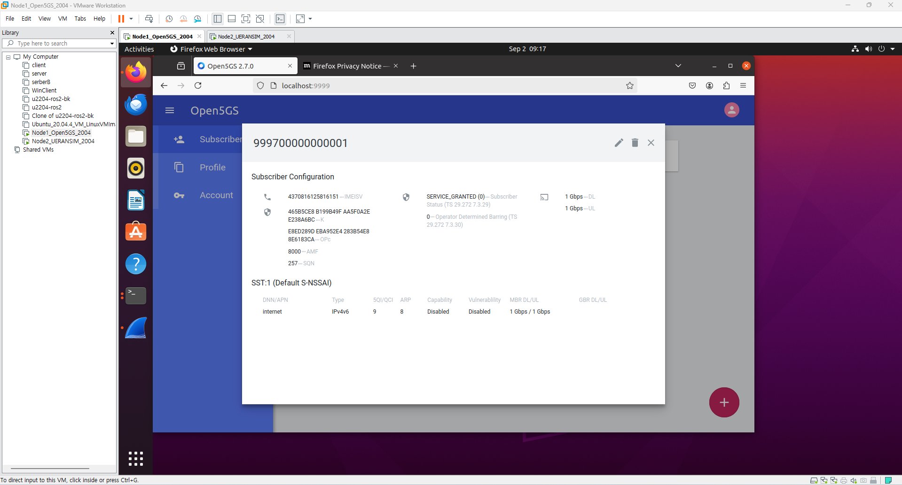

<span style="color:#222222"> __node\#2\(5G RAN\) \- __ </span>  <span style="color:#222222"> __UERANSIM Installation__ </span>

<span style="color:#222222">Node\#2: Ubuntu 20\.04:</span>

<span style="color:#222222">Install UERANSIM</span>

<span style="color:#222222">Config UERANSIM</span>

<span style="color:#222222">gNodeB</span>  <span style="color:#222222"> setting</span>

<span style="color:#222222">\# install git</span>

<span style="color:#222222">sudo</span>  <span style="color:#222222"> apt update</span>  <span style="color:#222222">sudo</span>  <span style="color:#222222"> apt upgrade</span>  <span style="color:#222222">sudo</span>  <span style="color:#222222"> apt install git \-y</span>  <span style="color:#222222">​</span>

<span style="color:#222222">\# cloning </span>  <span style="color:#222222">ueransim</span>  <span style="color:#222222"> source</span>  <span style="color:#222222">cd ~</span>  <span style="color:#222222">git clone </span>  <span style="color:#006dd7"> _[https://github\.com/aligungr/UERANSIM](https://github.com/aligungr/UERANSIM)_ </span>  <span style="color:#222222">​</span>

<span style="color:#222222">\# install dev tools</span>  <span style="color:#222222">sudo</span>  <span style="color:#222222"> apt install make \-y</span>  <span style="color:#222222">sudo</span>  <span style="color:#222222"> apt install </span>  <span style="color:#222222">gcc</span>  <span style="color:#222222"> \-y</span>  <span style="color:#222222">sudo</span>  <span style="color:#222222"> apt install g\+\+ \-y</span>  <span style="color:#222222">sudo</span>  <span style="color:#222222"> apt install </span>  <span style="color:#222222">libsctp</span>  <span style="color:#222222">\-dev </span>  <span style="color:#222222">lksctp</span>  <span style="color:#222222">\-tools \-y</span>  <span style="color:#222222">sudo</span>  <span style="color:#222222"> apt install iproute2 \-y</span>  <span style="color:#222222">sudo</span>  <span style="color:#222222"> snap install </span>  <span style="color:#222222">cmake</span>  <span style="color:#222222"> \-\-classic</span>

\# <span style="color:#222222">​ build</span>  <span style="color:#222222">cd ~/UERANSIM</span>  <span style="color:#222222">make \-j2</span>


* <span style="color:#222222">vi ~/UERANSIM/config/open5gs\-gnb\.yaml:</span>
  * <span style="color:#222222">\-\-\-\-\-\-\-\-</span>
  * <span style="color:#222222">linkIp</span>  <span style="color:#222222">: 127\.0\.0\.1   \# </span>  <span style="color:#222222">gNB's</span>  <span style="color:#222222"> local IP address for Radio Link Simulation \(Usually same with local IP\)</span>
  * <span style="color:#222222">ngapIp</span>  <span style="color:#222222">: 192\.168\.19\.12   \# </span>  <span style="color:#222222">gNB's</span>  <span style="color:#222222"> local IP address for N2 Interface \(Usually same with local IP\)</span>
  * <span style="color:#222222">gtpIp</span>  <span style="color:#222222">: 192\.168\.19\.12    \# </span>  <span style="color:#222222">gNB's</span>  <span style="color:#222222"> local IP address for N3 Interface \(Usually same with local IP\)</span>
  * <span style="color:#222222">\# List of AMF address information</span>
  * <span style="color:#222222">amfConfigs</span>  <span style="color:#222222">:</span>
  * <span style="color:#222222">  \- address: 192\.168\.19\.11</span>
  * <span style="color:#222222">    port: 38412</span>
  * <span style="color:#222222">\-\-\-\-\-\-\-\-</span>


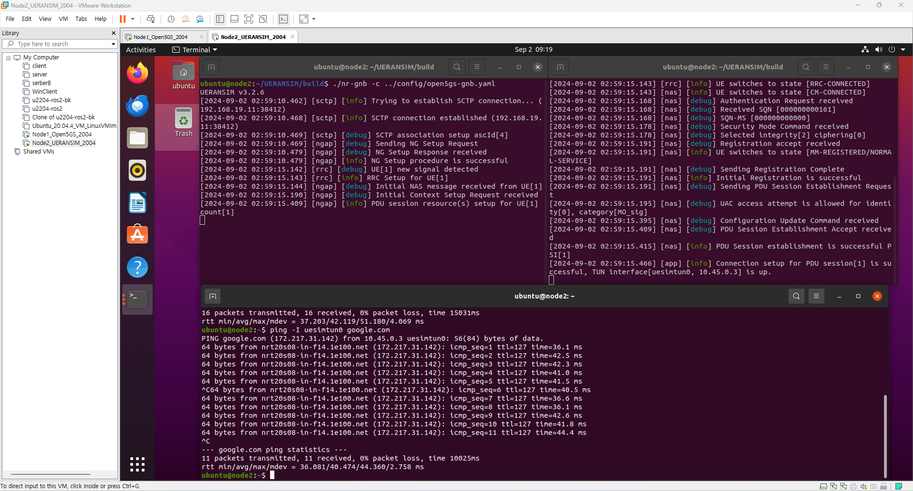

<span style="color:#222222">Node\#1: Open5GS</span>

<span style="color:#222222">Check whether Open5GS nodes are running:</span>

ps \-ef | grep open5gs

open5gs   179656       1  0 04:22 ?        00:01:24 /usr/bin/open5gs\-pcrfd \-c /etc/open5gs/pcrf\.yaml

open5gs   179824       1  0 04:22 ?        00:00:06 /usr/bin/open5gs\-pcfd \-c /etc/open5gs/pcf\.yaml

open5gs   179888       1  0 04:22 ?        00:00:31 /usr/bin/open5gs\-nrfd \-c /etc/open5gs/nrf\.yaml

open5gs   180063       1  0 04:22 ?        00:00:06 /usr/bin/open5gs\-udrd \-c /etc/open5gs/udr\.yaml

open5gs   180165       1  0 04:22 ?        00:01:16 /usr/bin/open5gs\-hssd \-c /etc/open5gs/hss\.yaml

open5gs   180267       1  0 04:22 ?        00:00:06 /usr/bin/open5gs\-bsfd \-c /etc/open5gs/bsf\.yaml

open5gs   180331       1  0 04:22 ?        00:01:12 /usr/bin/open5gs\-scpd \-c /etc/open5gs/scp\.yaml

open5gs   180395       1  0 04:22 ?        00:01:36 /usr/bin/open5gs\-smfd \-c /etc/open5gs/smf\.yaml

open5gs   180501       1  0 04:22 ?        00:00:20 /usr/bin/open5gs\-seppd \-c /etc/open5gs/sepp1\.yaml

open5gs   180565       1  0 04:22 ?        00:00:04 /usr/bin/open5gs\-sgwud \-c /etc/open5gs/sgwu\.yaml

open5gs   180629       1  0 04:22 ?        00:00:06 /usr/bin/open5gs\-ausfd \-c /etc/open5gs/ausf\.yaml

open5gs   180692       1  0 04:22 ?        00:01:26 /usr/bin/open5gs\-mmed \-c /etc/open5gs/mme\.yaml

open5gs   180798       1  0 04:22 ?        00:00:04 /usr/bin/open5gs\-sgwcd \-c /etc/open5gs/sgwc\.yaml

open5gs   180861       1  0 04:22 ?        00:00:06 /usr/bin/open5gs\-nssfd \-c /etc/open5gs/nssf\.yaml

open5gs   180924       1  0 04:22 ?        00:00:06 /usr/bin/open5gs\-udmd \-c /etc/open5gs/udm\.yaml

open5gs   184779       1  0 05:25 ?        00:00:04 /usr/bin/open5gs\-upfd \-c /etc/open5gs/upf\.yaml

open5gs   184805       1  0 05:26 ?        00:00:06 /usr/bin/open5gs\-amfd \-c /etc/open5gs/amf\.yaml


* <span style="color:#222222">Test Subscriber registration at Node\#1: Open5GS</span>
  * <span style="color:#222222">Run the browser \(node\#1 local default browser: </span>  <span style="color:#222222">firefox</span>  <span style="color:#222222">\)</span>
  * <span style="color:#222222">Enter the url: </span>  <span style="color:#222222">htttp://localhost:9999</span>
  * <span style="color:#222222">Login w</span>  <span style="color:#222222">ith </span>  <span style="color:#222222">Username: admin / Password: 1423</span>
  * <span style="color:#222222">Add Subscriber with IMSI \# as 999700000000001</span>
    * <span style="color:#222222"> Default test </span>  <span style="color:#222222">imsi</span>  <span style="color:#222222"> number</span>


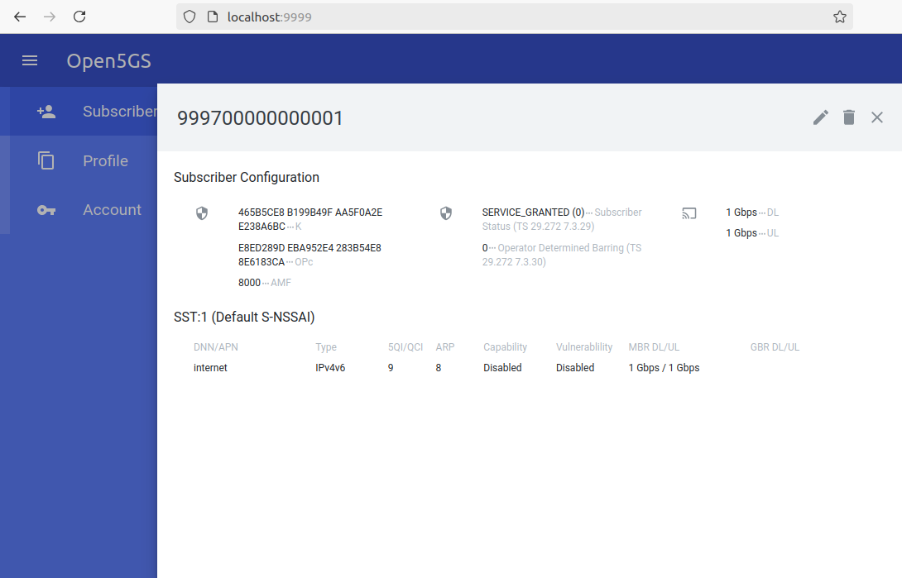

<span style="color:#222222">cd ~/UERANSIM/build</span>  <span style="color:#222222">\./nr\-</span>  <span style="color:#222222">gnb</span>  <span style="color:#222222"> \-c \.\./config/open5gs\-gnb\.yaml</span>

<span style="color:#222222">cd ~/UERANSIM/build</span>  <span style="color:#222222">sudo</span>  <span style="color:#222222"> \./nr\-</span>  <span style="color:#222222">ue</span>  <span style="color:#222222"> \-c \.\./config/open5gs\-ue\.yaml</span>

<span style="color:#222222">ping \-I uesimtun0 google\.com</span>

<span style="color:#222222">Node\#2: UERANSIM</span>

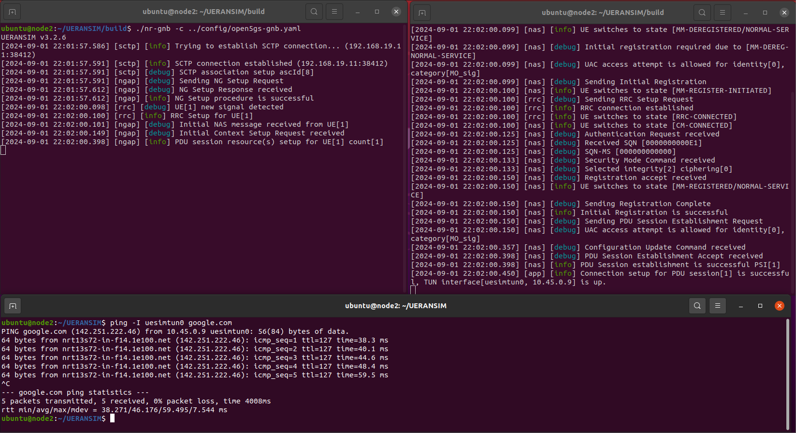

<span style="color:#222222"> __Run Wireshark on the node\#1\, Capture for any__ </span>

<span style="color:#222222">Node\#1: </span>  <span style="color:#222222">wireshark</span>  <span style="color:#222222">: filter </span>  <span style="color:#222222">ip\.addr</span>  <span style="color:#222222"> == 192\.168\.19\.12 => Node\#2</span>

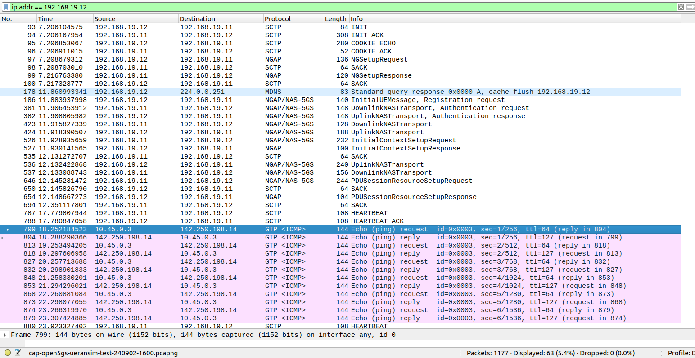


